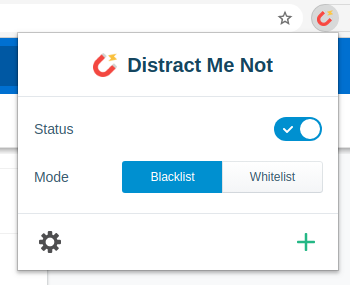

#  Distract Me Not 

> **Stay focused in a world full of distractions.**

Distract Me Not is a lightweight website blocker with a user friendly interface.

## Features

- Prevent access to a range of websites.
- Whitelist & blacklist mode.
- Custom page redirection.
- Display your custom message on blocked pages.
- Immediate closing of blocked tabs.
- Schedule blocking time.
- Export/Import websites lists.
- Protect your settings with a password.
- Unblock websites using a password.

## Installation

[How to install?](https://github.com/AXeL-dev/install-webextension)

## Technical

### Stack

- [React](https://reactjs.org/): Core library
- [evergreen-ui](https://evergreen.segment.com/): UI toolkit
- [bcryptjs](https://github.com/dcodeIO/bcrypt.js): Encryption library
- [fuzzaldrin-plus](https://github.com/jeancroy/fuzz-aldrin-plus): Data filtering library
- [query-string](https://github.com/sindresorhus/query-string): URL query strings parsing library

### Scripts

In the project directory, you can run:

#### `npm start`

Runs the app in the development mode. 
Open [http://localhost:3000](http://localhost:3000) to view it in the browser.

The page will reload if you make edits. 
You will also see any lint errors in the console.

#### `npm test`

Launches the test runner in the interactive watch mode. 
See the section about [running tests](https://facebook.github.io/create-react-app/docs/running-tests) for more information.

#### `npm run build`

Builds the app for production to the `build` folder. 
It correctly bundles React in production mode and optimizes the build for the best performance.

The build is minified and the filenames include the hashes. 
Your app is ready to be deployed!

See the section about [deployment](https://facebook.github.io/create-react-app/docs/deployment) for more information.

**Note:** for Firefox builds it's recommended to add the `:firefox` suffix to the build command like so `npm run build:firefox`.

#### `npm run package`

Packages the app in a zip file.

**Note:** the web-ext package is required. You can install it using `npm install -g web-ext`.

## Credits

Icon made by [Smashicons](https://www.flaticon.com/authors/smashicons) from [Flaticon](https://www.flaticon.com/).

## License

Distract Me Not is licensed under the [MIT license](LICENSE).
