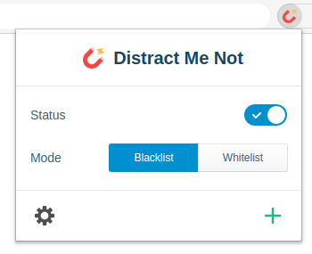

#  Distract Me Not 

> **Stay focused in a world full of distractions.**

Distract Me Not is a lightweight website blocker with a user friendly interface.

## Features

- Prevent access to a range of websites.
- Whitelist & blacklist mode.
- Custom page redirection.
- Display your custom message on blocked pages.
- Immediate closing of blocked tabs.
- Export/Import websites lists.

## Installation

[How to install?](https://github.com/AXeL-dev/install-webextension)

## Credits

Icon made by [Smashicons](https://www.flaticon.com/authors/smashicons) from [Flaticon](https://www.flaticon.com/).

## License

Distract Me Not is licensed under the [MIT license](LICENSE).
